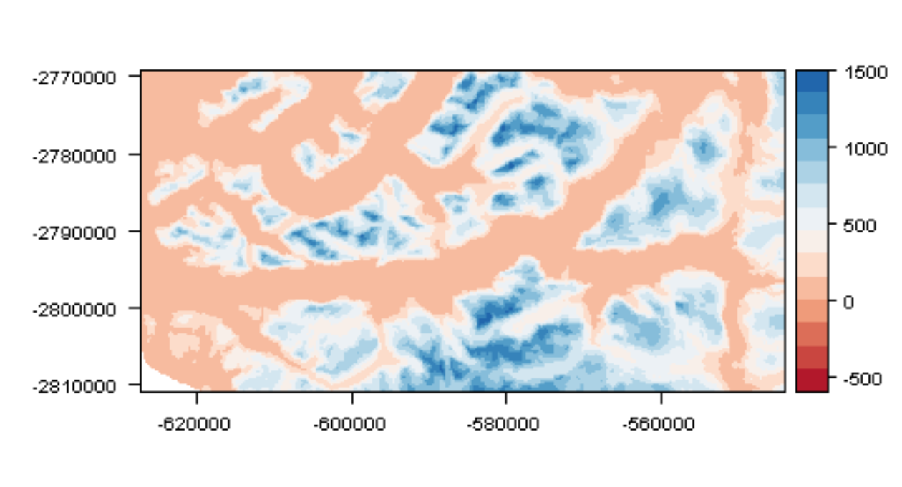

# Synthetic channel mesh routine

The code provided enables the creation of points with assigned elevations to populate channels where only the centreline is mapped. This is achieved by creating points normal to the centreline of a channel up to its banks, the extent of which is constrained by a land classification mask. 

The long profile elevation trend of the channel is derived from elevations at the head and mouth of the channel, including also any point observations within the channel. Where the centreline itself has only a known elevation at the head and mouth of its length, the long profile elevation trend is simply linear. The cross-profile is constructed as a second order polynomial, using elevations at either edge (using the nearest observed elevations) and the centreline elevation. The meshing procedure is described in [Williams et al., 2017](http://www.the-cryosphere.net/11/363/2017/tc-11-363-2017.html).

Image of example surface before...

and after....

and with the channel centrelines overlain...

## System requirements

The code is written in both Python and R. Your Python environment requires the following packages:

	- xxx
	- xxx
	- xxx
	- xxx

These can be installed using the anaconda installer such as by using:

	anaconda ....

R and requires the following libraries to be installed:

	- xxx
	- xxx
	- xxx
	- xxx
	
## Data Requirements

To take advantage of this code, you should have available:

- channel coordinates in csv format with columns of: x,y
- position and elevation of observations surrounding the channel in csv format with columns of: x,y,z
- any observations within the channel in csv format with columns of: x,y,z OR knowledge of a location at the head and mouth of the channel you propose to create (discussed later)
- a land classification mask as a .tif , the extent of which all points (above) are located 

A series of test data files are available in ./test_data which consist of the following:

* path_00*.csv     - centreline xy coordinates (x,y csv file)
* land_obs_xyz.csv - elevation observations (x,y,z csv file)
* aoi_mask.tif	   - land classification grid (channel (1) / not channel (0) raster)
* dist_mask.tif    - a distance raster (distance of channel pixels from non-channel pixels)
				   - this can be created later on and is provided here for speed

The coordinates within each file must all be in the same projection - this is not checked.

## How it works

The synthetic mesh routine consists of the following scripts (all stored in ./scripts):

- 01_densify_paths.py 	
- 02_centreline_normal_development_NOT_EQUIDISTANT_smoothing.R 	
- 03_restructure_data.py 
- 04_mask_clip.r 
- 05_get_channel_bank_elevation.py 	
- 06_channel_parabola_EDGE_ELEVATIONS_piecewise.r 
- 07_point_to_raster.r + 14_pnt2ras_N.r 
- 08_get_minimum_surface_from_stack.r
- 09_combine_and_interp.r

To summarize, the scripts implement the following:

- 01_densify_paths.py
+ - Creates equally spaced points at a user defined interval based on the centreline input (x,y).

- 02_centreline_normal_development_NOT_EQUIDISTANT_smoothing.r
+ - Calculates points normal to each centreline points relative the vector between points, *x* units either side of a given centreline node - the larger unit x, the smoother the profile (linearising the channel profile to a greater extent). 
+ - This creates the synthetic mesh points either side of a channel's centreline.

- 03_restructure_data.py
+ - Restructure the output of 02*.r, specifying channel sides (required for 04*.py onwards).

- 04_mask_clip.py
+ - Clips the points and their edges using the land classification mask - this limits overflow of channel normal points where channel does not have clearly defined sides.

- 05_get_channel_bank_elevation.py: Step XX  
+ - Assigns elevations to the synthetic mesh points at the edge of the channel based on the nearest observed points (out of the channel). 

- 06_channel_parabola_EDGE_ELEVATIONS_piecewise.r 
+ - assigns elevations to all points within the synthetic mesh.
+ - elevations at the beginning and end of the channel - the *seed* and *mouth* respectively - can be set either using the nearest neighbour from provided observations within the channel or by being specifically declared.
+ - for a given cross-section, any other point observations available within the channel are incorporated with the pre-defined edge elevations to calculate a cross channel parabola from which the centreline elevation is extracted.
+ - the centreline elevations that are set - the mouth, seed and any other nodes close to points (for which a threshold value is set) - are then used to assign elevations to all other centreline nodes, providing elevations along the entire centreline. Where only the seed and mouth are known, this will be linear, otherwise it will be piecewise.
+ - Parabolas are then calculated for each node using the centreline elevation and prior-set edge elevations, providing elevations across each cross section.

- 07_point_to_raster.r 
+ - Grids the mesh nodes to a specific resolution, averaging the elevations where multiple cross-sections overlap such as at meanders. 

- 08_get_minimum_surface_from_stack.r 
+ - Where multiple synthetic channels have been created within an AOI, overlaps are likely such as at confluences. 
+ - This combines all of the rasterised synthetic channels, taking the minimum elevation at overlaps, thus preserving deeper channels within a system.
+ - Returned from this script are raster (geotif) and point xyz (csv) datasets of the combined synthetic dataset.

- 09_combine_and_interp.r
+ - This provides an example of how you can integrate the synthetic points with other observations using simple interpolation to provide a DEM with your synthetic channel - a quick way to compare a surface with and without synthetic intervention.
+ - More sophisticated interpolation routines should be experimented with - this is just for a visual representation!

## Implementation

At the bottom of each script is an example of how to run the code using the provided test data (see ./test_data). Running on a script by script basis may be preferable as there are numerous settings that can be altered and you may wish to modify/create new functions to suit your specific needs. 

An example of how to run the whole process in bash (assuming your R and python environments are correctly set-up) is provided here:

- ./scripts/DIY.sh

## Example run

To run the code with the examples, either run each script directly or run `example_script.sh`.

The input test data outputs go respectively to:
	./GitHub/synthetic_channel_mesh/test_data
	./GitHub/synthetic_channel_mesh/test_outputs

**NB/ The code has been set-up such that all scripts and functions work within this directory structure - if you change these locations or perhaps add the functions to your system path, you will need to alter the path declarations in each script accordingly.**

## Comments and further development

The settings currently defined suited the application for which the code was developed but are not definitive as the synthetic meshing conditions will change per application. Furthermore, elements of the code could be made more efficient/more widely applicable - feel free to make developments as you see fit.

#######################

## To do

[ ] License - free to use/modify but please reference the Williams2017 paper and/or the code location

[ ] Reset the functions path...

[ ] Show examples of how to run code at bottom of each script
	-- R equivalent of pythons if __name__ == "__main__" is:
		if (getOption('run.main', default=TRUE)) {
	 		 main()
		}

	see here: https://stackoverflow.com/questions/21383058/is-ifinteractive-an-r-equivalent-to-the-pythonic-if-name-main

[ ] Show how to call code from a single bash script 
	- see ./scripts/DIY.sh
	- use the exampls from the bottom of each script

[ ] Show how to create a quick look spline overview of the improvements...
		-- DIY.sh

Explain:
[ ] - true_centre
[ ] - sensitivity to observations - if anything is available, it will tie to it...

